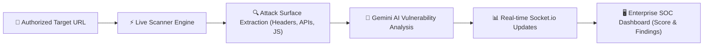

# 🛡️ Saksham AI () — Working & Architecture Overview

## 1. यह प्रोजेक्ट क्या करता है? (What Does This Project Do?)

**Saksham AI ()** एक **Enterprise Autonomous Cybersecurity Operations Center (SOC) & Vulnerability Scanner Platform** है। 

यह किसी भी वेब एप्लिकेशन, API एंडपॉइंट या वेब इंफ्रास्ट्रक्चर की **सुरक्षा (Security Posture)** को ऑटोमेटेड तरीके से जांचता है। यह पूरे अटैक सरफेस (Attack Surface) का विश्लेषण करके संभावित सिक्योरिटी कमियों (Vulnerabilities/Findings) को खोजता है, उनका **CVSS Severity Score** निकालता है और **Gemini AI** की मदद से उनका समाधान (Remediation Steps) प्रदान करता है।

---

## 2. समस्या और समाधान (Problem & Solution)

### 🔴 समस्या (The Problem)
1. **Manual Security Auditing is Slow & Costly**: ट्रेडिशनल पेनेट्रेशन टेस्टिंग (Penetration Testing) में हफ्तों लगते हैं और भारी खर्च आता है।
2. **Unprotected APIs & Missing Headers**: डेवलपर्स अक्सर सिक्योरिटी हेडर्स (जैसे CSP, HSTS), IDOR एंडपॉइंट्स, या API अथॉराइजेशन चेक लगाना भूल जाते हैं।
3. **Complex Security Tools**: पुराने SIEM/SOC टूल्स का UI बहुत जटिल होता है और रियल-टाइम डेटा फ्लो समझना मुश्किल होता है।

### 🟢 समाधान (The Solution)
1. **Automated Live Probing**: Saksham AI एक सिंगल क्लिक में लाइव एंडपॉइंट्स, रूट्स, सिक्योरिटी हेडर्स, JS एसेट्स और डिपेंडेंसीज का लाइव स्कैन करता है।
2. **AI-Driven Threat Intelligence**: Gemini AI हर पाई गई सिक्योरिटी कमी (Finding) का एनालिसिस करता है और डेवलपर को तुरंत फिक्स गाइड बताता है।
3. **Enterprise SOC Dashboard**: visual data-flow pipeline (Left Sources → Central Security Analysis Node → Right Severity Cards) के साथ लाइव सिक्योरिटी स्कोर प्रस्तुत करता है।

---

## 3. इसमें हमने क्या-क्या नया जोड़ा है? (Features & Systems Added)

### 🎨 A. Production Enterprise SOC Redesign
- **Mature Enterprise Theme**: फालतू AI बैज, साइबरपंक नियन ग्लो (Neon Glow) और अनियंत्रित ग्रेडिएंट्स हटाकर Datadog / Cloudflare / CrowdStrike स्टाइल का डार्क नेवी/चारकोल इंटरफेस बनाया।
- **Dynamic Attack-Surface Data-Flow Visualizer**:
  - **Left Side**: 6 स्रोत कार्ड्स (`API Endpoints`, `Routes`, `Technologies`, `Security Headers`, `JS Assets`, `Dependencies`).
  - **Center Hub (`SecurityAnalysisHub`)**: डुअल-रिंग डार्क सिक्योरिटी नोड जो लाइव ट्रैक्ड फाइंडिंग्स और सिक्योरिटी स्कोर (`SCORE 78/100`) दिखाता है।
  - **Right Side**: 5 सेवेरिटी रिस्पॉन्स कार्ड्स (`Critical` 🔴, `High` 🟠, `Medium` 🟡, `Low` 🟢, `Verified` 🔵).
  - **Subtle Data-Flow Connectors**: स्मूथ SVG बेज़ियर कर्व्स जो डेटा ट्रांसफर फ्लो (`stroke-dasharray="4 8"`) प्रदर्शित करते हैं।

### 🔔 B. Security Notification Center & Alert Drawer
- **Top Navigation Bell Icon**: एक्टिव अनरीड बैज काउंटर के साथ।
- **Security Alerts Panel**: पॉप-ओवर पैनल जिसमें हर अलर्ट की Severity (`🔴 CRITICAL`, `🔴 HIGH`, `🟡 MEDIUM`, `🟢 VERIFIED`), समय, और स्टेटस दिखता है।
- **Interactive Controls**: `Mark as read`, `Mark all as read`, `Clear notifications`, और सीधे Finding पर जाने के लिए क्विक एक्शन।

### ⚡ C. Cybersecurity Toast Notification System
- **5 Toast Levels**: `critical`, `warning`, `success`, `error`, `info`
- **SOC Features**: सिक्योरिटी आइकॉन, टाइटल, मैसेज, टाइमस्टैम्प, एक्शन बटन (`View Finding`, `Review`), और ऑटो-डिसमिस।
- **Sound Feedback**: ब्राउज़र की native **Web Audio API** द्वारा सिंथेसाइज्ड प्रोफेशनल साइबर साउंड इफ़ेक्ट (`alert`, `toast`, `click`) - बिना किसी बाहरी MP3 फ़ाइल के।

### 🎛️ D. Custom Enterprise Dropdowns (`CustomSelect`)
- **100% Replacement**: पूरे प्रोजेक्ट से ब्राउज़र के डिफ़ॉल्ट/विंडोज `<select>` ड्रॉपडाउन हटाकर कस्टम डार्क SOC ड्रॉपडाउन लगाए गए।
- **Features**: कस्टम शेवरॉन आइकॉन, सिलेक्टेड आइटम टिकमार्क, होवर स्टेट्स, स्क्रॉलेबल लिस्ट (`max-h-60 overflow-y-auto`), क्लिक-आउटसाइड डिसमिसल, और Z-Index लेयरिंग।

### ⚙️ E. Backend Audit & Engine Hardening
- **Target Enum Fix**: Target model में `'Production'` एनम जोड़ा गया ताकि प्रॉडक्शन टारगेट स्कैन फेल न हों।
- **Worker Robustness**: `assessmentWorker.js` में सेवेरिटी नॉर्मलाइजेशन और एसेट/फाइंडिंग डेटा सैनिटाइजेशन को मजबूत किया गया ताकि `Finding.insertMany` पर कोई वैलिडेशन एरर न आए।

---

## 4. मुख्य वर्किंग फ्लो (System Workflow)

---

## 5. प्रोजेक्ट की वर्तमान स्थिति (Current Status)

- **Frontend**: Vite + React 19 (`http://localhost:5173`) — 100% Clean Production Build (`npm run build` Verified).
- **Backend**: Express + MongoDB + Socket.io (`http://localhost:5000`) — Active & Running.
